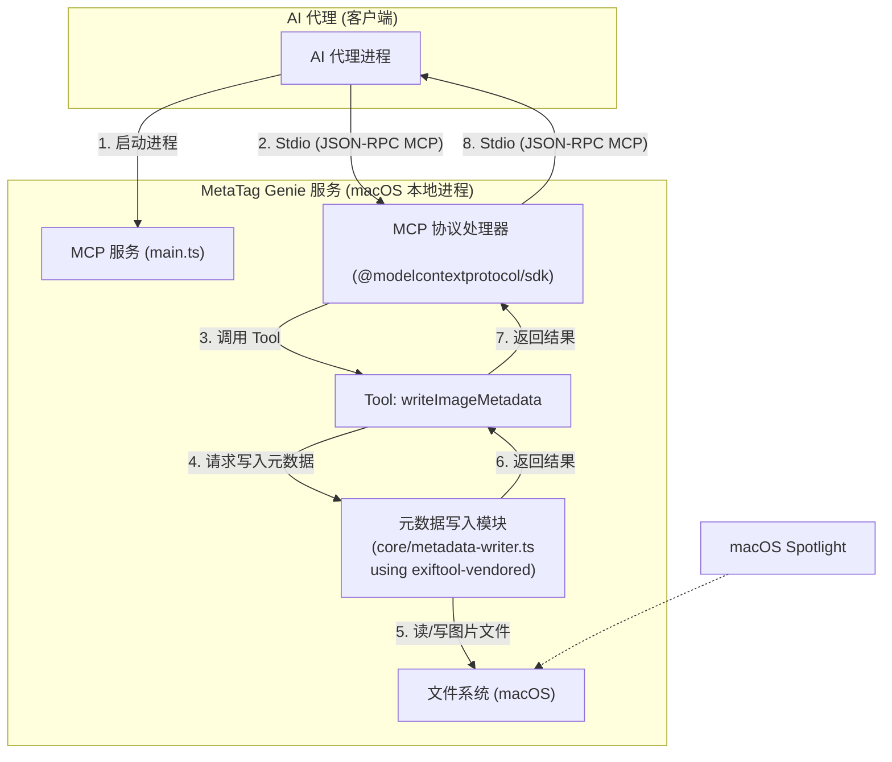
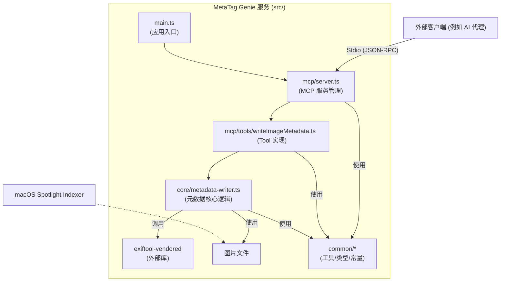

# MetaTag Genie 架构文档

## 技术摘要

元标记精灵 (MetaTag Genie) 是一个 macOS 后台服务，它通过标准输入/输出 (Stdio) 使用 Model Context Protocol (MCP) 与客户端（如 AI 代理）进行通信。其核心目标是允许用户将结构化的元数据（标签、描述、人物、地点）写入本地图片文件 (JPG, PNG, HEIC)，以显著增强 macOS Spotlight 的图片搜索体验。本项目使用 Node.js 和 TypeScript 构建，核心元数据处理依赖 `exiftool-vendored`，MCP 服务实现依赖 `@modelcontextprotocol/sdk`。项目遵循测试驱动开发 (TDD) 原则。

## 高层概览

MetaTag Genie 的架构风格是一个**本地命令行服务 (CLI-based Service)**，它以后台进程的形式运行，并通过 Stdio 进行 JSON-RPC 2.0 通信，遵循 MCP 规范。这种设计使其能够被 AI 代理或其他本地应用程序作为子进程直接调用和管理。

主要的用户交互流程（从 AI 代理的角度看）如下：
1. AI 代理启动 MetaTag Genie 服务进程。
2. AI 代理通过 Stdio 与 MetaTag Genie 服务进行 MCP 初始化握手。
3. AI 代理调用 MetaTag Genie 服务暴露的 `writeImageMetadata` Tool，通过 Stdio 发送包含图片路径和元数据信息的 JSON-RPC 请求。
4. MetaTag Genie 服务接收请求，使用 `exiftool-vendored` 将元数据写入指定的图片文件。
5. MetaTag Genie 服务通过 Stdio 将操作结果（成功或失败）以 JSON-RPC 响应的形式返回给 AI 代理。
6. AI 代理（或 macOS 系统）后续可以通过 Spotlight 搜索到这些包含新元数据的图片。

## 组件视图

系统的主要逻辑组件及其职责如下：

* **`main.ts` (应用入口)**: 负责初始化整个应用程序，启动 MCP 服务并处理顶层的错误和信号。
* **`mcp/server.ts` (MCP 服务管理)**:
    * 使用 `@modelcontextprotocol/sdk` 初始化并配置 MCP 服务器。
    * 负责注册所有可用的 MCP Tools (例如 `writeImageMetadata`)。
    * 处理 MCP 协议层面的消息（初始化、Tool 调用请求等）和 Stdio 通信。
* **`mcp/tools/writeImageMetadata.ts` (Tool 实现)**:
    * 实现 `writeImageMetadata` Tool 的具体逻辑。
    * 定义 Tool 的参数 (JSON Schema) 和返回值。
    * 接收来自 MCP 服务的调用请求，解析参数。
    * 调用 `core/metadata-writer.ts` 来执行实际的元数据写入操作。
    * 格式化执行结果或错误，并返回给 MCP 服务层。
* **`core/metadata-writer.ts` (元数据核心逻辑)**:
    * 封装与 `exiftool-vendored` 库的交互。
    * 提供清晰的 API（例如 `writeMetadata(filePath, metadata)` 和 `readMetadata(filePath)`）。
    * 处理不同图片格式 (JPG, PNG, HEIC) 的元数据写入和读取细节。
    * 实现元数据字段到标准 EXIF/IPTC/XMP 字段的映射（根据 Story 2.5 的最终决定）。
    * 包含错误处理逻辑，确保文件操作的安全性。
    * 使用 Node.js `fs` 模块进行必要的文件系统检查（如文件是否存在、可读写）。
* **`exiftool-vendored` (外部库)**: 实际执行图片元数据读写操作的底层工具。
* **`Node.js fs` (内置模块)**: Node.js 内置的文件系统模块，用于基本的文件操作和检查。
* **`common/*` (通用工具/类型/常量)**: 提供项目中共享的工具函数、TypeScript 类型定义、常量和自定义错误类。

## 关键架构决策与模式

* **技术栈选择**:
    * **语言/运行时**: TypeScript 和 Node.js (PRD 要求)。
    * **MCP SDK**: `@modelcontextprotocol/sdk` (简化 MCP 实现，支持 Stdio)。
    * **元数据处理**: `exiftool-vendored` (强大的格式支持和可靠性，特别是 HEIC)。
    * **测试**: Jest, ESLint, Prettier (社区标准，良好生态)。
    * *理由*: 详见 `docs/tech-stack.md`。
* **通信方式**: Stdio (标准输入/输出) 上的 JSON-RPC 2.0 (PRD 要求, MCP 规范)。
    * *理由*: 适用于本地进程间通信，便于 AI 代理集成。
* **服务模式**: 本地后台服务进程 (无网络端口监听)。
    * *理由*: 满足 MVP 作为本地工具的需求，简化部署。
* **模块化设计**: 代码按功能划分为 `common`, `core`, `mcp` 等模块。
    * *理由*: 提高可维护性、可测试性，便于 AI 代理理解和修改 (参考 `docs/project-structure.md`)。
* **错误处理**: 在 Tool 实现层面捕获错误，并通过 JSON-RPC 错误对象返回给客户端 (Epic 3)。
    * *理由*: 提供清晰的错误反馈，符合 JSON-RPC 规范。
* **配置**: MVP 阶段无外部配置文件，主要通过 Tool 参数传递。
* **Spotlight 集成**: 通过将元数据写入 Spotlight 已知的标准字段来实现。具体字段映射将在 Story 2.5 中确定。
* **TDD (测试驱动开发)**: 作为核心开发流程 (PRD 要求)。

## 基础设施和部署概述

* **云提供商**: 不适用 (本地 macOS 服务)。
* **核心服务使用**: macOS 文件系统, Spotlight。
* **基础设施即代码 (IaC)**: 不适用。
* **部署策略**:
    * MVP 阶段：可能通过提供可执行脚本或简单的打包方式（例如，使用 `pkg` 将 Node.js 应用打包成单个可执行文件，方便 AI 代理调用）。
    * AI 代理将负责管理 MetaTag Genie 服务进程的生命周期。
* **环境**: 本地开发环境 (macOS)。

## 关键参考文件

* `docs/prd.md`
* `docs/epic1.md`, `docs/epic2.md`, `docs/epic3.md`, `docs/epic4.md`
* `docs/tech-stack.md`
* `docs/project-structure.md`
* `docs/coding-standards.md`
* `docs/mcp-tools-definition.md` 
* `docs/environment-vars.md`
* `docs/testing-strategy.md`

## 变更日志

| 变更内容      | 日期       | 版本  | 描述                                       | 作者        |
| ------------- | ---------- | ----- | ------------------------------------------ | ----------- |
| 初稿          | 2025-05-07 | 0.1   | 基于 PRD 和已确认的技术决策创建             | 3-Architect |
